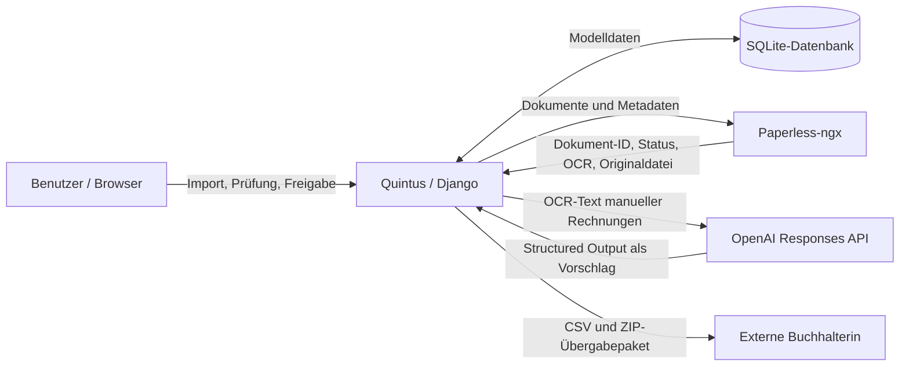
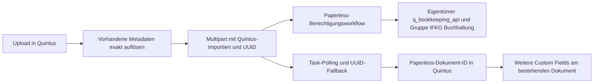
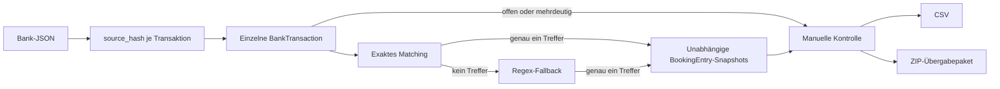

# Quintus Buchhaltung – Systemdokumentation

## 1. Zweck und Abgrenzung

Die Quintus-Buchhaltung unterstützt die Aufbereitung und Kontrolle der laufenden Buchhaltung der Immo-Fuchs KG. Quintus importiert Banktransaktionen, wendet Matching-Regeln an, erzeugt eigenständige Buchungszeilen und stellt geprüfte Daten für den Export bereit.

Die Verantwortlichkeiten sind klar getrennt:

- **Quintus** ist die fachliche Quelle für Matching-Regeln und deren Versionen, Buchungszeilen, Kontrollzustände und den für Exporte maßgeblichen Status.
- **Paperless-ngx** bleibt das Dokumentenarchiv. Dort liegen die Originaldokumente, die OCR-Texte und die Paperless-Metadaten.
- **OpenAI** verarbeitet ausschließlich den aus Paperless abgerufenen OCR-Text manueller Rechnungen und liefert strukturierte Vorschläge. OpenAI schließt keine Rechnung ab und erzeugt keine verbindliche Buchung.
- Die **externe Buchhalterin** erhält die geprüften Buchungszeilen als CSV sowie die zugehörigen Dokumente und Hinweise im ZIP-Übergabepaket.

Quintus ersetzt weder Paperless als Archiv noch die fachliche Kontrolle durch den Benutzer. Umgekehrt ist Paperless nicht die Quelle für Matching-Entscheidungen, Buchungszeilen oder den Exportstatus.

## 2. Systemübersicht



In der SQLite-Datenbank speichert Quintus insbesondere Banktransaktionen, versionierte Matching-Regeln, Buchungsvorlagen, erzeugte Buchungszeilen, manuelle Rechnungsdaten, Paperless-Referenzen und Kontrollsalden. Binärdateien werden während eines ausgehenden Uploads nur vorübergehend im Django-Medienbereich gehalten und nach erfolgreicher Paperless-Zuordnung entfernt.

Paperless speichert die Originaldokumente, OCR-Inhalte sowie Dokumenttyp, Tags, Speicherpfad, Korrespondent und Zusatzfelder. Quintus speichert zu einer Dokumentverknüpfung die eigene UUID und die von Paperless zurückgemeldete Dokument-ID. Der Paperless-Task wird bis zur eindeutigen Zuordnung abgefragt; bei unklarem Zustand verhindert Quintus einen unkontrollierten Doppelupload.

An OpenAI wird nur OCR-Text einer manuellen Rechnung gesendet. Das strukturierte Analyseergebnis und technische Analyseinformationen werden beim `ManualInvoice` gespeichert. API-Schlüssel werden weder an Templates übergeben noch in der Datenbank gespeichert.

Die Buchhalterin erhält keine Arbeitsdatenbank, sondern eine wiederholbar erzeugte Ausgabe: Buchungszeilen im österreichischen CSV-Format sowie, beim Übergabepaket, die zugehörigen Originaldokumente aus Paperless und eine Übersicht mit Hinweisen.

## 3. Zentrale Datenobjekte in Quintus

Der aktuelle Datenstand wird durch die Bookkeeping-Migrationen `0001` bis `0019` beschrieben. Die folgenden Abschnitte fassen die fachlich wichtigen Modelle zusammen, ohne die vollständige Felddefinition zu wiederholen.

### 3.1 `BankTransaction`

- **Zweck:** Repräsentiert genau eine importierte oder manuell angelegte Kontobewegung. Importierte Datensätze besitzen zur Dublettenvermeidung einen eindeutigen `source_hash`.
- **Beziehungen:** Kann auf genau die verwendete `MatchingRule`-Version zeigen und besitzt eigene `BookingEntry`-Zeilen. Für jede fertige Bankbuchung ist mindestens ein direkt zugeordneter `SupportingDocument`-Beleg erforderlich.
- **Status:** `imported` (Eingelesen), `matched` (Zugeordnet), `reviewed` (Geprüft) und `booked` (Gebucht). In der Oberfläche gelten `reviewed` und `booked` als „Buchungsfertig“. Der aktuelle Abschluss setzt `reviewed`; ein bereits vorhandenes `booked` wird nicht zurückgestuft. Exporte verändern den Status nicht.
- **Änderbarkeit und Snapshot:** Notizen und Buchungszeilen können über die vorgesehenen Masken bearbeitet oder zurückgesetzt werden. Die importierten Transaktionsdaten bleiben die Referenz für Betrag und Richtung. Ein Zurücksetzen löscht nur die Buchungszeilen, nicht die Transaktion, ihre Regelzuordnung oder Dokumente.

### 3.2 `MatchingRule` und Regelversionen

- **Zweck:** Beschreibt eine aktive oder historische Regel für exaktes Matching oder Regex-Matching.
- **Beziehungen:** Eine Version besitzt Buchungsvorlagen, kann von Banktransaktionen referenziert werden und kann Matching-Nachweise als `SupportingDocument` besitzen. Versionen sind über `previous_version` zu einer linearen Historie verbunden.
- **Status:** Es gibt keinen fachlichen Buchungsstatus, sondern `active` sowie eine fortlaufende `version_number`. Bei einer neuen Version wird die bisherige Version deaktiviert und die Nachfolgeversion aktiviert.
- **Änderbarkeit und Snapshot:** Solange eine Regel nicht verwendet wurde, kann sie einschließlich ihrer Vorlagen bearbeitet werden. Nach der ersten Verwendung sind die fachlichen Regelfelder und Vorlagen schreibgeschützt; Änderungen erfolgen über eine neue Version mit Änderungsgrund. Eine verwendete Regel oder eine Vorgängerversion kann nicht gelöscht werden. Bereits zugeordnete Transaktionen behalten die konkret verwendete Version.

### 3.3 `MatchingRuleBookingTemplate`

- **Zweck:** Definiert die Buchungszeilen, die eine Matching-Regel bei einem Treffer vorschlägt bzw. automatisch als Snapshot erzeugt.
- **Beziehungen:** Jede Vorlage gehört genau zu einer `MatchingRule`-Version und hat innerhalb dieser Version eine eindeutige Position.
- **Status:** Kein eigener Status. Die Änderbarkeit folgt der zugehörigen Regelversion.
- **Änderbarkeit und Snapshot:** Vor Verwendung der Regel können Text, Partner, Betrag, USt-Symbol und Kategorie bearbeitet werden. Höchstens eine Zeile darf einen Restbetrag offenlassen; sobald für eine Regex-Regel Buchungsvorlagen definiert sind, ist genau eine Restbetragszeile erforderlich. Nach Verwendung der Regel sind die Vorlagen unveränderlich. Erzeugte `BookingEntry`-Zeilen sind unabhängige Kopien und keine dynamischen Ansichten auf die Vorlage.

### 3.4 `BookingEntry`

- **Zweck:** Enthält eine konkrete Buchungszeile zu einer einzelnen Banktransaktion.
- **Beziehungen:** Gehört genau zu einer `BankTransaction`. Mehrere Buchungszeilen dürfen eine Transaktion aufteilen, müssen beim Abschluss aber in Summe deren exakten Betrag ergeben; eine Differenz von genau einem Cent wird in der betragsmäßig größten Zeile ausgeglichen.
- **Status:** Kein eigener Status. Die Exportfähigkeit ergibt sich aus dem Status der zugehörigen Banktransaktion.
- **Änderbarkeit und Snapshot:** Automatisch aus einer Regel erzeugte Werte sind ein eigenständiger Snapshot und können fachlich geprüft und bearbeitet werden. Spätere Änderungen oder neue Versionen der Matching-Regel ändern bestehende Buchungszeilen nicht. Beim Zurücksetzen werden die Zeilen gelöscht und können neu erfasst werden.

### 3.5 `ManualInvoice`

- **Zweck:** Hält den Quintus-Arbeitsstand einer manuell hochgeladenen oder aus Paperless übernommenen Eingangsrechnung.
- **Beziehungen:** Besitzt eigene `ManualInvoiceEntry`-Zeilen und verweist über `reference_uuid` und `paperless_document_id` auf genau ein Paperless-Dokument. Eine Paperless-Dokument-ID darf lokal nur einmal verwendet werden.
- **Status:** Fachlich `draft` (Entwurf) oder `ready` (Buchungsfertig). Daneben bestehen getrennte Zustände für Paperless-Übertragung und KI-Analyse, einschließlich ausstehend, abgeschlossen und fehlgeschlagen.
- **Änderbarkeit und Snapshot:** Rechnungsdaten und Buchungszeilen bleiben im Entwurf editierbar. KI-Daten sind Vorschläge; bereits vorhandene Rechnungsfelder und bereits gespeicherte Buchungszeilen werden durch eine Analyse nicht überschrieben. Nach Abschluss bleiben die gespeicherten Werte exportierbar; ein Buchungssatz kann gezielt wieder auf Entwurf zurückgesetzt werden. Die bewusst erfolgte reine Paperless-Löschung wird lokal dauerhaft markiert und sperrt einen automatischen Wiederupload dieses Datensatzes.

### 3.6 `ManualInvoiceEntry`

- **Zweck:** Repräsentiert eine konkrete Buchungszeile einer manuellen Rechnung, üblicherweise eine Zeile je USt-Satz.
- **Beziehungen:** Gehört genau zu einem `ManualInvoice`; die Position bestimmt die Reihenfolge.
- **Status:** Kein eigener Status. Die Zeile wird exportiert, wenn die Rechnung `ready` ist.
- **Änderbarkeit und Snapshot:** Der Benutzer kontrolliert Buchungstext, Betrag, USt-Symbol und Kategorie. Zahlungsdatum, Belegkreis `PR` und die daraus abgeleitete Belegnummer werden aus der Rechnung geführt. Beim Abschluss müssen die Zeilen den Gesamtbruttobetrag ergeben; eine Differenz von genau einem Cent kann automatisch ausgeglichen werden.

### 3.7 `BankStatement`

- **Zweck:** Speichert die aus einem Kontoauszugs-PDF gelesenen Monats- und Saldeninformationen sowie die Paperless-Übertragung.
- **Beziehungen:** Es gibt keine direkte Fremdschlüsselbeziehung zu Transaktionen. Die Abstimmung erfolgt über Buchungsmonat und Valutadatum der Banktransaktionen.
- **Status:** Paperless-Status `pending`, `completed` oder `failed`. Zusätzlich wird festgehalten, ob eine historische Referenz bereits auf die UUID-basierte `q_bookkeeping_referenz` synchronisiert wurde.
- **Änderbarkeit und Snapshot:** Die aus dem PDF gelesenen Daten bilden den importierten Kontoauszugsstand. Dubletten werden über Datei-Hash sowie IBAN, Jahr und Auszugsnummer verhindert. Nach erfolgreicher Paperless-Ablage wird die temporäre PDF entfernt; bei einem kontrolliert fehlgeschlagenen Upload kann sie für einen Retry erhalten bleiben.

### 3.8 `SupportingDocument`

- **Zweck:** Verknüpft einen Buchungsbeleg mit genau einer Banktransaktion oder einen Matching-Nachweis mit genau einer Matching-Regelversion.
- **Beziehungen:** Eine Datenbank- und Modellprüfung erzwingt genau einen Besitzer: entweder `bank_transaction` oder `matching_rule`, nie beide und nie keinen.
- **Status:** Übertragung `pending`, `completed` oder `failed`.
- **Änderbarkeit und Snapshot:** UUID, Paperless-Dokument-ID, Dateiname und Besitzer bilden die Verknüpfung. Bei erfolgreicher Ablage wird die temporäre Datei entfernt. Ein Matching-Nachweis bleibt an der konkreten, unveränderlichen Regelversion und wandert nicht zu einer Nachfolgeversion.

### 3.9 `QuarterBalance`

- **Zweck:** Hält optionalen Anfangs- und Endsaldo für eine Quartalsabstimmung.
- **Beziehungen:** Keine Fremdschlüssel; Jahr und Quartal sind gemeinsam eindeutig.
- **Status:** Kein eigener Status.
- **Änderbarkeit und Snapshot:** Die Salden können für das Quartal aktualisiert werden. Sie ergänzen die Kontrolle, verändern aber weder Transaktionen noch Buchungszeilen oder Exportstatus.

## 4. Bankimport und Matching

Der implementierte Ablauf ist:

1. Der Benutzer lädt eine JSON-Datei hoch. Die Wurzel muss ein Array sein; jedes Element wird als einzelne Banktransaktion validiert.
2. Quintus bildet aus dem vollständigen, sortiert serialisierten JSON-Objekt einen SHA-256-`source_hash`.
3. Noch nicht vorhandene Hashes werden als einzelne `BankTransaction`-Datensätze gespeichert. Bereits vorhandene Hashes werden gezählt und nicht erneut angelegt. Ein historisch fehlendes Valutadatum darf bei einem erneuten identischen Import ergänzt werden.
4. Für jede Transaktion im Status `imported` prüft Quintus zuerst aktive exakte Regeln. Der Schlüssel besteht aus normalisierter Partner-IBAN, Richtung und dem absoluten, exakten Transaktionsbetrag.
5. Nur wenn keine exakte Regel trifft, werden aktive Regex-Regeln als Fallback geprüft. Das Muster wird ohne Beachtung der Groß-/Kleinschreibung auf Partnername und Verwendungszweck angewendet; Richtung und eine optional in der Regel gesetzte IBAN müssen ebenfalls passen.
6. Exakte Regeln haben damit Vorrang vor Regex-Regeln. Treffen innerhalb der jeweils geprüften Stufe mehrere Regeln, bleibt die Transaktion wegen Mehrdeutigkeit offen. Es gibt kein frei konfigurierbares numerisches Prioritätsfeld.
7. Bei genau einem Treffer speichert Quintus die konkrete Regelversion. Sind verwendbare Buchungsvorlagen vorhanden, werden daraus unabhängige `BookingEntry`-Snapshots erzeugt. Feste Teilbeträge und höchstens eine Restbetragszeile müssen exakt zum Transaktionsbetrag passen. Ein erfolgreicher Snapshot setzt die Transaktion auf `reviewed`; eine unvollständige Vorlage lässt sie als `matched` zur manuellen Bearbeitung stehen.
8. Offene oder unvollständig zugeordnete Transaktionen werden vom Benutzer manuell bearbeitet. Beim Abschluss sind mindestens eine vollständige Buchungszeile und die exakte Betragsübereinstimmung erforderlich.
9. Abgeschlossene Transaktionen erscheinen als „Buchungsfertig“. Technisch umfasst diese Ansicht die Statuswerte `reviewed` und `booked`.

Wesentliche fachliche Eigenschaften:

- Transaktionen werden **nicht summiert oder zusammengefasst**. Jede Kontobewegung wird einzeln importiert, gematcht und gegen ihren eigenen exakten Betrag geprüft.
- Das Betrags-Matching verwendet den absoluten Einzelbetrag; die Richtung wird separat geprüft. Die erzeugten Buchungsbeträge behalten das Vorzeichen der Transaktion.
- Fachliche Änderungen an einer bereits verwendeten Matching-Regel erfolgen über eine neue Version. Die alte Version bleibt als Historie erhalten und wird deaktiviert.
- Bereits erzeugte Buchungszeilen sind Snapshots. Sie ändern sich nicht, wenn später eine Regel geändert, deaktiviert oder als neue Version fortgeführt wird.

## 5. Manuelle Belege

### 5.1 Ablauf bei Upload aus Quintus

1. Der Benutzer lädt eine PDF in Quintus hoch. Ein SHA-256-Datei-Hash verhindert einen zweiten lokalen Datensatz für dieselbe Datei.
2. Quintus legt den lokalen `ManualInvoice`-Datensatz an und startet unmittelbar den asynchronen Multipart-Upload nach Paperless. Bis Paperless den Task eindeutig auflöst, bleibt die PDF temporär in Quintus verfügbar.
3. Die UUID des `ManualInvoice` wird bereits beim ersten Upload als `q_bookkeeping_referenz` übergeben.
4. Nach erfolgreicher Task-Auflösung speichert Quintus die Paperless-Dokument-ID, entfernt die temporäre PDF und liest den OCR-Text über die Paperless-Dokument-API.
5. Nur für manuelle Rechnungen sendet Quintus den OCR-Text an die OpenAI Responses API. Die Antwort muss dem im Code definierten strikten JSON-Schema entsprechen.
6. Der strukturierte Vorschlag enthält Rechnungsdaten und genau eine zusammengefasste Buchungszeile je erkanntem USt-Satz. Beträge werden rechnerisch gegen den Gesamtbruttobetrag geprüft.
7. Der Benutzer prüft und bearbeitet Rechnungsdaten und Buchungszeilen. Unklare USt-Sätze oder Kategorien bleiben leer bzw. werden mit einem Hinweis versehen.
8. Erst „Prüfen und abschließen“ validiert Pflichtfelder und Summen und setzt den fachlichen Status auf `ready`.
9. Erst nach diesem geprüften Abschluss aktualisiert Quintus beim bestehenden Paperless-Dokument `q_buchungsdatum`, `q_buchungsmonat` und `q_buchungsquartal` anhand des bestätigten Zahlungsdatums.
10. Die `ManualInvoiceEntry`-Zeilen erscheinen anschließend gemeinsam mit den fertigen Bankbuchungen unter „Buchungsfertig“ und in Exporten.

### 5.2 Verbindlichkeit und Schutz vorhandener Daten

- KI-Werte sind ausschließlich Vorschläge. Eine KI-Analyse setzt eine Rechnung niemals automatisch auf `ready`.
- Bereits befüllte Rechnungsfelder werden durch die Analyse nicht überschrieben. Bereits gespeicherte Buchungszeilen bleiben ebenfalls unverändert.
- Analyse, erneute OCR-Prüfung und Abschluss verwenden das bereits verknüpfte Paperless-Dokument. Sie lösen keinen erneuten Dokumentupload aus.
- USt-Symbol und Kategorie bleiben in den editierbaren Buchungszeilen unter Kontrolle des Benutzers.
- Fehlt ein eindeutiges Zahlungsdatum oder ist die Zahlungsrichtung unklar, werden Beträge bzw. Buchungszeilen nicht unkontrolliert übernommen.
- Ein Abschluss ist nur möglich, wenn das Paperless-Dokument eindeutig als abgelegt bekannt ist. Scheitert ausschließlich die Aktualisierung der Datumsfelder, bleibt ein verständlicher Fehler gespeichert und die Aktualisierung kann ohne neuen Upload wiederholt werden.

### 5.3 Übernahme aus Paperless/E-Mail

Ein bereits in Paperless vorhandenes Dokument wird nicht heruntergeladen und nicht erneut hochgeladen. Quintus erzeugt einen `ManualInvoice`-Entwurf mit der vorhandenen Paperless-Dokument-ID, ergänzt `q_bookkeeping_referenz`, ersetzt die Prozessmarkierung `Quintus-Import` durch `Quintus-Importiert` und ruft anschließend OCR und gegebenenfalls die KI-Analyse auf.

Beim Entwurf bleiben `q_buchungsdatum`, `q_buchungsmonat` und `q_buchungsquartal` bewusst ungesetzt. Erst der Abschluss mit dem vom Benutzer geprüften Zahlungsdatum aktualisiert diese Felder. Dabei bleiben fremde bzw. bereits vorhandene Paperless-Zusatzfelder erhalten.

## 6. Belege zu Banktransaktionen und Matching-Regeln

`SupportingDocument` deckt zwei fachlich verschiedene Fälle ab:

- Ein Beleg zu einer `BankTransaction` ist ein `Buchungsbeleg`. Er wird ohne OCR- oder KI-Auswertung abgelegt. Das Datum der Transaktion bestimmt die Paperless-Datums- und Zeitraumfelder.
- Ein Beleg zu einer `MatchingRule` ist ein `Matching-Nachweis`. Er gehört dauerhaft zu genau dieser Regelversion. Eine spätere Nachfolgeversion übernimmt den Nachweis nicht automatisch.

Die Zuordnung verwendet eine in Quintus erzeugte UUID als `q_bookkeeping_referenz`. Nach dem asynchronen Upload speichert Quintus zusätzlich die eindeutige Paperless-Dokument-ID. Task-Abfrage und UUID-Suche verhindern bei Retry und Polling einen unkontrollierten zweiten Upload.

Die Dokumentaktionen haben unterschiedliche Folgen:

- **Verknüpfung entfernen:** Löscht nur den lokalen `SupportingDocument`-Datensatz und eine gegebenenfalls verbliebene temporäre Datei. Das Dokument bleibt in Paperless bestehen.
- **Supporting Document aus Paperless löschen:** Löscht bei vorhandener Dokument-ID zuerst das Paperless-Dokument und danach die lokale Verknüpfung.
- **Nur aus Paperless löschen:** Diese Aktion gehört zum manuellen Beleg. Das Paperless-Dokument wird gelöscht, der `ManualInvoice` mit seinen Buchungszeilen bleibt in Quintus erhalten und wird als bewusst gelöscht markiert.
- **Manuellen Beleg vollständig löschen:** Behandelt zuerst das eindeutig identifizierte Paperless-Dokument und löscht anschließend `ManualInvoice`, Buchungszeilen und eine gegebenenfalls vorhandene temporäre PDF aus Quintus.

Keine dieser Dokumentaktionen löscht die besitzende Banktransaktion oder Matching-Regel. Matching-Regeln können unabhängig davon nur gelöscht werden, solange sie unbenutzt sind und keine Nachfolgeversion besitzen; für Banktransaktionen gibt es im Bookkeeping-UI keinen vollständigen Löschpfad.

## 7. Paperless-Konfiguration

Paperless-Benutzer, Gruppen, E-Mail-Regeln, Workflows und die automatische Inhaltszuordnung werden nicht von Quintus angelegt. Die folgenden entsprechend gekennzeichneten Angaben sind **manuell in Paperless konfiguriert**. Quintus erwartet die im Code genannten Metadaten und bricht bei fehlenden Pflichtobjekten verständlich ab, statt sie automatisch anzulegen.

### 7.1 Benutzer und Gruppe

Manuell in Paperless konfiguriert:

- administrativer Benutzer: `admin`
- API-Benutzer: `q_bookkeeping_api`
- gemeinsame Gruppe: `IFKG Buchhaltung`
- Eigentümer der Bookkeeping-Dokumente: `q_bookkeeping_api`
- Gruppe `IFKG Buchhaltung`: Anzeigen und Bearbeiten
- `admin` kann als Paperless-Superuser alle Dokumente sehen.

Quintus verwendet technisch ausschließlich den in `PAPERLESS_API_TOKEN` hinterlegten Token. Dass dieser Token zu `q_bookkeeping_api` gehört, ist eine manuell einzuhaltende Betriebs- und Paperless-Konfiguration und aus dem Token selbst nicht im Anwendungscode überprüfbar. Eigentümer und Gruppenrechte werden bei Bookkeeping-Uploads nicht zusätzlich per API gesetzt; dies übernimmt der unten beschriebene Paperless-Workflow.

### 7.2 Tags

| Tag | Zweck | Lebenszyklus |
|---|---|---|
| `Buchhaltung` | Fachlicher Grundtag für Buchhaltungsdokumente | Wird bei direkten Bookkeeping-Uploads mitgesendet und ist auch Teil der E-Mail-Regel. |
| `Immo-Fuchs KG` | Zuordnung zum Unternehmen | Wird bei direkten Bookkeeping-Uploads mitgesendet und ist auch Teil der E-Mail-Regel. |
| `Quintus-Import` | Eingang aus Paperless/E-Mail, der auf die Übernahme durch Quintus wartet | Wird manuell durch die Paperless-E-Mail-Regel gesetzt. Bei erfolgreicher Übernahme entfernt Quintus diesen Tag und setzt `Quintus-Importiert`. |
| `Quintus-Importiert` | Dokument ist bereits mit Quintus verknüpft oder direkt aus Quintus hochgeladen | Direkte Uploads enthalten den eindeutig aufgelösten vorhandenen Tag bereits im ersten Multipart-Request. Beim E-Mail-Import ersetzt er `Quintus-Import`. |
| `Quintus-Fehler` | Die Übernahme eines Paperless-Eingangs durch Quintus ist fehlgeschlagen | Quintus entfernt die Import-Prozess-Tags und setzt den Fehler-Tag, ohne andere Dokumenttags zu ersetzen. |
| `Neu` | Dokument benötigt manuelle Bearbeitung in Paperless | Wird ausschließlich durch den allgemeinen Paperless-Workflow gesetzt, wenn weder `Quintus-Import` noch `Quintus-Importiert` vorhanden ist. Quintus sendet diesen Tag nicht. |

Manuell in Paperless konfiguriert: Die automatische Inhaltszuordnung für die Steuerungs-Tags `Quintus-Import`, `Quintus-Importiert`, `Quintus-Fehler` und `Neu` ist deaktiviert.

Bei eigenen Uploads sendet Quintus weder `Neu` noch `Quintus-Import`. Der kanonische Tag `Quintus-Importiert` muss vor dem Upload unter exakt diesem Namen eindeutig vorhanden sein; kein Treffer oder mehrere exakte Treffer verhindern den Upload.

### 7.3 E-Mail-Regel `q_bookkeeping`

Manuell in Paperless konfiguriert:

- Name: `q_bookkeeping`
- Bedingung: Betreff enthält `bookkeeping`
- Verarbeitung: nur Anhänge
- Tags: `Quintus-Import`, `Immo-Fuchs KG`, `Buchhaltung`
- Dokumenttyp: `Eingangsrechnung`
- weitere Verarbeitung stoppen
- kein durch die E-Mail-Regel erzwungener Korrespondent

Quintus sucht Dokumente anhand des exakten Import-Tags, übernimmt sie batchweise und idempotent über die Paperless-Dokument-ID. Die Übernahme ist sowohl über die Oberfläche als auch über den Management-Command möglich.

### 7.4 Paperless-Workflows

#### Workflow 1: `Quintus-Dokumente – Berechtigungen`

Manuell in Paperless konfiguriert:

- Trigger: Dokument hinzugefügt
- Filter: Dokument besitzt `Quintus-Import` oder `Quintus-Importiert`
- Eigentümer setzen: `q_bookkeeping_api`
- Gruppe `IFKG Buchhaltung`: Anzeigen und Bearbeiten

#### Workflow 2: `Tag new doc as new`

Manuell in Paperless konfiguriert:

- Trigger: Dokument hinzugefügt
- Filter: Dokument besitzt weder `Quintus-Import` noch `Quintus-Importiert`
- Aktion: Tag `Neu`

Quintus sendet bei eigenen Uploads `Quintus-Importiert` bereits im ursprünglichen Multipart-Aufruf an `/api/documents/post_document/`. Dadurch kann der Berechtigungsworkflow unmittelbar beim Ereignis „Dokument hinzugefügt“ greifen, während das Dokument vom `Neu`-Workflow ausgeschlossen bleibt.

### 7.5 Zusatzfelder

| Exakter Name | Paperless-Typ | Inhalt und Zeitpunkt |
|---|---|---|
| `q_bookkeeping_referenz` | Text | UUID der Quintus-Verknüpfung. Bei direkten Uploads im ersten Request, bei Paperless/E-Mail-Import durch ein Update des bestehenden Dokuments. |
| `q_buchungsdatum` | Datum | Geprüftes Zahlungs- bzw. Belegdatum. Bei Kontoauszügen und Banktransaktionsbelegen direkt bekannt; bei manuellen Rechnungen erst nach Abschluss. |
| `q_buchungsmonat` | Text | Zeitraum im Format `YYYY-MM`. |
| `q_buchungsquartal` | Text | Zeitraum im Format `YYYY-Qn`, beispielsweise `2026-Q3`. |

Bei ungeprüften E-Mail-Entwürfen sind die drei Datums- und Zeitraumfelder bewusst noch nicht gesetzt, weil der aus OCR oder KI stammende Zahlungszeitpunkt nicht verbindlich ist. Der Abschluss übernimmt ausschließlich das vom Benutzer bestätigte Zahlungsdatum und bewahrt sonstige vorhandene Custom Fields.

### 7.6 Speicherpfade

| Exakter Speicherpfad | Dokumente |
|---|---|
| `IFKG Eingangsrechnungen` | `ManualInvoice`-Dokumente sowie `SupportingDocument`-Buchungsbelege zu Banktransaktionen. Die Dokumenttypen bleiben dabei `Eingangsrechnung` bzw. `Buchungsbeleg`. |
| `IFKG Kontoauszüge` | `BankStatement`-Dokumente mit Dokumenttyp `Kontoauszug`. |
| `IFKG Matching-Nachweise` | `SupportingDocument`-Nachweise zu einer konkreten Matching-Regelversion mit Dokumenttyp `Buchungsbeleg`. |

Die Speicherpfade müssen unter dem exakten Namen jeweils genau einmal vorhanden sein. Quintus legt sie nicht an. Der frühere Name `IFKG Buchungsbelege` wird im aktuellen Bookkeeping-Code nicht erwartet.

## 8. Dokumentflüsse

### 8.1 E-Mail → Paperless → Quintus


Das Dokument bleibt während des gesamten Ablaufs dasselbe Paperless-Dokument. Quintus lädt es weder beim Import noch bei OCR, KI-Analyse oder Abschluss erneut hoch.

### 8.2 Quintus → Paperless



Fehlt ein benötigter Tag, Dokumenttyp, Korrespondent, Zusatzfeld oder Speicherpfad, wird kein Metadatum automatisch angelegt. Der Upload bricht kontrolliert ab. Nach einem unklaren Task-Ergebnis sucht Quintus anhand der UUID, bevor ein Retry einen neuen Upload auslösen darf.

### 8.3 Bank-JSON → Buchungszeilen → Export



Jede Transaktion bleibt einzeln. Weder Import noch Matching oder Export summieren mehrere Kontobewegungen zu einem neuen Datensatz.

## 9. Buchungsfertig und Übergabepaket

Die Ansicht „Buchungsfertig“ unterstützt Monats- und Quartalszeiträume. Für den ausgewählten Zeitraum kontrolliert Quintus insbesondere:

- offene Banktransaktionen,
- Anzahl und Summe der Buchungszeilen,
- Übereinstimmung jeder fertigen Banktransaktion mit ihren Buchungszeilen,
- manuelle Rechnungszeilen,
- Bankbewegung sowie Anfangs-, End- und errechneten Saldo,
- vorhandene Kontoauszüge und deren Abgleich mit importierten JSON-Transaktionen.

Für Monate werden die Salden aus dem importierten Kontoauszug verwendet. Für Quartale können Anfangs- und Endsaldo in `QuarterBalance` gepflegt werden. Diese Kontrollwerte ändern keine Buchung.

### 9.1 CSV-Export

Der CSV-Export enthält fertige `BookingEntry`- und `ManualInvoiceEntry`-Zeilen eines Quartals. Er ist wiederholbar und verändert keinen Status. Bei fachlich inkonsistenten Buchungszeilen wird der Export kontrolliert verweigert.

Das Format ist auf die österreichische Weiterverarbeitung ausgerichtet:

- Semikolon als Trennzeichen,
- UTF-8 mit BOM,
- Datum `TT.MM.JJJJ`,
- Dezimalkomma,
- Kategorie als vollständige Kategoriebezeichnung statt nur als Code.

### 9.2 ZIP-Übergabepaket

Das Übergabepaket kann für einen verfügbaren fertigen Monat oder ein Quartal erzeugt werden. Es enthält:

- `Buchungszeilen_<Zeitraum>.csv`,
- `Uebersicht_<Zeitraum>.csv` mit Dokumentstatus, Paperless-ID und Hinweisen,
- manuelle Rechnungen im Ordner `Rechnungen`,
- Belege zu Banktransaktionen im Ordner `Bankbelege`,
- Kontoauszüge im Ordner `Kontoauszuege`,
- optionale Regelbelege im Ordner `Matching-Nachweise`.

Originaldokumente werden beim Erstellen anhand ihrer gespeicherten Paperless-ID aus Paperless geladen. Dieselbe Paperless-ID wird höchstens einmal in das ZIP aufgenommen, auch wenn mehrere Beziehungen darauf verweisen. Technische Paperless- oder Archivfehler brechen die Paketerstellung ab; ein in Paperless nicht mehr auffindbares Einzeldokument wird dagegen als Hinweis in der Übersicht ausgewiesen.

Das Paket bleibt trotz fachlicher Hinweise erzeugbar. Insbesondere sind fehlende Monatskontoauszüge bei einem noch laufenden Quartal erwartbare Hinweise: Für ein Quartal werden immer alle drei Monatsauszüge erwartet, auch wenn spätere Monate noch nicht abgeschlossen sind. Offene Transaktionen, fehlende Dokumente und inkonsistente Buchungszeilen werden ebenfalls transparent in der Paketvorschau und Übersicht ausgewiesen.

Auch das Übergabepaket ist ein reiner Lese- und Downloadvorgang. Es setzt weder `reviewed` auf `booked` noch verändert es andere Datenbankstatus.

## 10. Löschen und Zurücksetzen

| Aktion | Was in Quintus erhalten bleibt | Was in Paperless erhalten bleibt | Erneuter Upload | Bestätigung |
|---|---|---|---|---|
| Buchungssatz zurücksetzen | Die `BankTransaction` bzw. der `ManualInvoice`, Quelldaten, Notizen, Regelzuordnung und Dokumentverknüpfungen bleiben. Nur die zugehörigen Buchungszeilen werden gelöscht; der Status geht auf `matched`/`imported` bzw. `draft` zurück. | Alle Dokumente bleiben unverändert. | Kein Dokumentupload nötig; Buchungszeilen können erneut erfasst und abgeschlossen werden. | Ja, eigene Bestätigungsseite. |
| Verknüpfung entfernen | Besitzer (`BankTransaction` oder `MatchingRule`) bleibt; der lokale `SupportingDocument`-Datensatz wird entfernt. | Das Dokument bleibt vollständig bestehen. | Ein neuer Beleg kann hochgeladen und neu verknüpft werden; das alte Paperless-Dokument bleibt dabei unberührt. | Ja, eigene Bestätigungsseite. |
| Nur aus Paperless löschen | `ManualInvoice`, Rechnungsdaten und Buchungszeilen bleiben. Der Datensatz wird als bewusst aus Paperless gelöscht markiert und verliert Task- und Dokument-ID. | Das eindeutig zugeordnete Dokument wird gelöscht. | Für denselben lokalen Datensatz bewusst nicht vorgesehen und technisch gesperrt. | Ja, eigene Bestätigungsseite. |
| Manuellen Beleg vollständig löschen | Nichts vom manuellen Beleg: Rechnung, Buchungszeilen und temporäre Datei werden lokal gelöscht. Andere Buchhaltungsdaten bleiben unberührt. | Das eindeutig identifizierte Rechnungsdokument wird zuerst gelöscht bzw. als nicht vorhanden bestätigt. Bei unklarem oder fehlgeschlagenem Paperless-Zugriff wird die lokale Löschung abgebrochen. | Nach erfolgreicher vollständiger Löschung kann dieselbe PDF als neuer Datensatz mit neuer UUID hochgeladen werden. | Ja, eigene Bestätigungsseite. |

Zusätzlich kann ein `SupportingDocument` über die Löschaktion aus Paperless **und** aus Quintus entfernt werden. Auch dabei bleiben die zugehörige Banktransaktion oder Matching-Regelversion erhalten.

## 11. Konfiguration

Die Dokumentation nennt bewusst nur Variablennamen und den im Code definierten Modell-Fallback. Werte aus einer realen `.env` werden nicht wiedergegeben.

### 11.1 Paperless-Verbindung für Bookkeeping

| Umgebungsvariable | Verwendung |
|---|---|
| `PAPERLESS_BASE_URL` | Basisadresse der Paperless-Instanz; mit oder ohne abschließendes `/api` verwendbar. |
| `PAPERLESS_API_TOKEN` | API-Token für Upload, Suche, Metadatenänderung, OCR-Abruf, Download und Löschung. Im Betrieb muss dies der Token von `q_bookkeeping_api` sein. |
| `PAPERLESS_TIMEOUT_SECONDS` | Zeitlimit für Paperless-Anfragen. |

Bookkeeping nutzt die gemeinsame Paperless-Verbindung der Quintus-Anwendung. Für seine Dokumente verwendet es jedoch eigene, im Code exakt benannte Dokumenttypen, Korrespondenten, Tags, Zusatzfelder und Speicherpfade. Bestehende objektbezogene Paperless-Parameter der Hausverwaltung werden dadurch weder ersetzt noch für Bookkeeping-Dokumente umgedeutet.

Es gibt im aktuellen Code keine separaten Umgebungsvariablen mit dem Präfix `BOOKKEEPING_PAPERLESS_`. Die Bookkeeping-Metadaten werden anhand ihrer exakten Paperless-Namen aufgelöst und niemals automatisch angelegt.

### 11.2 OpenAI für manuelle Rechnungen

| Umgebungsvariable | Verwendung |
|---|---|
| `BOOKKEEPING_OPENAI_API_KEY` | Zugang zur OpenAI Responses API. Fehlt die Variable, bleibt die manuelle Erfassung verfügbar und die KI-Analyse wird nicht ausgeführt. |
| `BOOKKEEPING_OPENAI_MODEL` | Modell für die strukturierte Rechnungsanalyse. Der im Code definierte Fallback ist `gpt-4.1-mini`; ein gegebenenfalls abweichender realer Umgebungswert wird hier nicht offengelegt. |

### 11.3 Allgemeiner Django-Betrieb

Für den Betrieb der gesamten Django-Anwendung und damit auch des Bookkeeping-Bereichs sind außerdem die allgemeinen Variablen `DJANGO_SECRET_KEY`, `DJANGO_DEBUG` und `DJANGO_ALLOWED_HOSTS` relevant. Sie sind nicht Bookkeeping-spezifisch.

Temporäre PDFs verwenden den konfigurierten Django-Medienbereich. Dafür besteht im aktuellen `.env.example` keine zusätzliche Bookkeeping-Umgebungsvariable.

## 12. Betrieb und Deployment

Der vorhandene lokale Deployment-Ablauf wird aus dem Projektverzeichnis gestartet:

```bash
cd ~/apps/quintus
./deploy-local.sh
```

Das aktuelle Skript verwendet den Python-Interpreter aus `.venv` und führt in dieser Reihenfolge aus:

1. `python manage.py check`
2. `python manage.py makemigrations --check --dry-run`
3. `python manage.py migrate --noinput`
4. `python manage.py collectstatic --noinput`
5. Neustart des systemd-Dienstes `quintus`
6. Prüfung, ob der Dienst aktiv ist

Das Skript führt selbst keine Anwendungstests aus. Migrationen, `collectstatic` und Dienstneustart sind Bestandteil des tatsächlichen Deployment-Skripts, nicht eines normalen Dokumentenimports.

Bereits in Paperless eingegangene Rechnungen können zusätzlich über den vorhandenen Management-Command verarbeitet werden:

```bash
.venv/bin/python manage.py import_paperless_invoices
```

Der Command verarbeitet standardmäßig einen begrenzten Batch, ist über die eindeutige Paperless-Dokument-ID wiederholbar und unterstützt eine reine Vorschau:

```bash
.venv/bin/python manage.py import_paperless_invoices --dry-run
```

Die gleiche Übernahme kann in der Oberfläche unter „Manuelle Belege“ ausgelöst werden. Eine automatische Zeitplanung dieses Commands ist im aktuellen Repository nicht definiert und wäre daher als externe Betriebskonfiguration zu dokumentieren.
